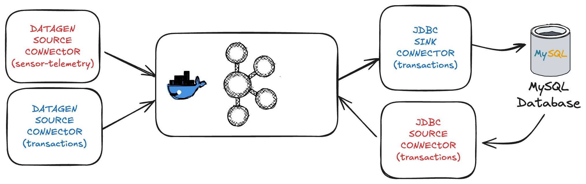

# Tarea

El objetivo de esta carpeta es facilitar el desarrollo de la tarea.

## Organización

La carpeta se organiza en los directorios

- **datagen**: contiene los schemas de los dos datasets de FarmIA (*.avsc)

- **connectors**: contiene los ficheros de configuración de los conectores a desarrollar (*.json)

## Setup

El siguiente script automatiza algunos de los pasos necesarios para preparar el entorno
para desarrollar la tarea.

1. Inicia el entorno.
2. Crea la tabla transactions.
3. Instala los plugins de los conectores.
4. Copia los drivers JDBC para MySQL.
5. Copia los schemas AVRO dentro del contenedor de connect.

```shell
./setup.sh
```

## Kafka Connect

Con el fin de simular un escenario real y crear interactividad en la tabla de transacciones se proporcionan un par de conectores para cargar la tabla transactions forma continua.



Los conectores proporcionados hacen uso del topic **_transactions** para cargar la tabla **sales_transactions** en la bd MySQL

- source-datagen-_transactions: Genera transacciones que cumplen el schema requerido

- sink-mysql-_transactions: Escribe las transacciones en la tabla de base de datos 

El alumno es responsable de crear los dos conectores en rojo:

- source-datagen-sensor-telemetry [DatagenSource](https://github.com/confluentinc/kafka-connect-datagen/blob/master/README.md#configuration) 

- source-mysql-transactions [JDBCSource](https://docs.confluent.io/kafka-connectors/jdbc/current/source-connector/overview.html)

**NOTA**

Explorar el **modo incremental** para el conector JDBCSource utilizando la columna timestamp

Para poder hacer el procesamiento posterior es **importante** que los registros generados por ambos conectores lleven el campo **key** informado.
En alguno de los conectores pueden requerir aplicar SMTs (Simple Message Transformations)

De igual modo, se proporciona un script para automatizar la ejecución de todos los conectores:

```shell
./start_connectors.sh
```

**NOTA**

Los conectores a desarrollar por el alumno están comentados en el script. Descomentar una vez completados

## Kafka Streams

A completar por el alumno.

## Shutdown

El siguiente script para el entorno

```shell
./shutdown.sh
```

------------------------------------------------------------------------------------------------------------------------------------------------------

## Plan de Trabajo
Tarea 1: Integración de MySQL con Kafka Connect
Tarea 2: Generación de Datos Sintéticos con Kafka Connect
Tarea 3: Procesamiento en Tiempo Real con Kafka Streams (Sensores IoT)
Tarea 4: Procesamiento en Tiempo Real con Kafka Streams (Resumen de Ventas)

## Organización del Proyecto

README.md (Se va actualizando conforme avancemos)

connectors/

sink-mysql-_transactions.json (Ya configurado)
source-datagen-_transactions.json (Ya configurado)
source-datagen-sensor-telemetry.json (Falta crear)
source-mysql-transactions.json (Falta crear)

datagen/

sensor-telemetry.avsc (Falta completar)
transactions.avsc (Ya configurado)

sql/

transactions.sql (Ya configurado)

streaming/

SalesSummaryApp.java (Falta desarrollar)
SensorAlerterApp.java (Falta desarrollar)

scripts/

start_connectors.sh (Se debe desmarcar)
shutdown.sh (Ya configurado)

docker/

docker-compose.yml (Ya configurado)


# Tarea 1: Integración de MySQL con Kafka Connect (transactions)

Objetivo:
Configurar un JDBC Source Connector para extraer datos de MySQL y publicarlos en el topic sales-transactions.

## Workflow:
1. Crear el archivo source-mysql-transactions.json en la carpeta connectors/.
2. Configurar el conector JDBC para leer la tabla sales_transactions.
3️. Definir el modo incremental utilizando el campo timestamp.
4️. Registrar el conector en Kafka Connect.
5️. Validar que los datos lleguen correctamente al topic sales-transactions.


{
  "name": "source-mysql-transactions",
  "config": {
    "connector.class": "io.confluent.connect.jdbc.JdbcSourceConnector",
    "tasks.max": "1",
    "connection.url": "jdbc:mysql://mysql:3306/db?user=user&password=password&useSSL=false",
    "mode": "timestamp",
    "timestamp.column.name": "timestamp",
    "topic.prefix": "sales-transactions",
    "table.whitelist": "sales_transactions",
    "poll.interval.ms": "1000",
    "validate.non.null": "false",
    "numeric.mapping": "best_fit",
    "key.converter": "org.apache.kafka.connect.storage.StringConverter",
    "value.converter": "io.confluent.connect.avro.AvroConverter",
    "value.converter.schema.registry.url": "http://schema-registry:8081"
  }
}

Este conector:
- Se conecta a MySQL.
- Lee la tabla sales_transactions.
- Usa el modo incremental con la columna timestamp.
- Publica los datos en el topic sales-transactions.

- Ejecutamos el script de setup -> ./setup.sh
Este script crea y levanta los contenedores. 

- Verificamos que los contenedores estan correindo -> docker ps -a

- Verificamos que kafka connect esta corriendo con el siguiente comando:

curl -s http://localhost:8083/connectors | jq

"Tenemos el siguiente resultado:
[
  "source-datagen-_transactions",
  "sink-mysql-_transactions",
  "source-mysql-transactions"
]
"

- Verificamos el estado del conector:

curl -s http://localhost:8083/connectors/source-mysql-transactions/status | jq

"Tenemos el siguiente resultado: 
{
  "name": "source-mysql-transactions",
  "connector": {
    "state": "RUNNING",
    "worker_id": "connect:8083"
  },
  "tasks": [
    {
      "id": 0,
      "state": "RUNNING",
      "worker_id": "connect:8083"
    }
  ],
  "type": "source"
}"

- Verificamos que sales-transactions existe dentro de connect:

"docker exec -it connect bash"

kafka-topics --bootstrap-server broker-1:29092 --list

"VEMOS sales-transactions EN LA LISTA"

- Vemos si hay datos en la tabla de sales_transactions en MYSQL:

mysql> SELECT * FROM sales_transactions LIMIT 10;
+----------------+------------+-------------+----------+--------+---------------------+
| transaction_id | product_id | category    | quantity | price  | timestamp           |
+----------------+------------+-------------+----------+--------+---------------------+
| tx11112        | prod_265   | pesticides  |        1 |  91.73 | 2025-03-08 10:15:33 |
| tx11116        | prod_786   | soil        |        4 | 112.67 | 2025-03-08 09:15:13 |
| tx11121        | prod_137   | pesticides  |        7 | 146.85 | 2025-03-08 09:16:31 |
| tx11121        | prod_354   | soil        |        3 |  63.16 | 2025-03-08 09:20:46 |
| tx11151        | prod_829   | fertilizers |        4 |  94.87 | 2025-03-08 10:08:13 |
| tx11174        | prod_322   | soil        |        7 | 107.81 | 2025-03-08 10:17:09 |
| tx11189        | prod_963   | seeds       |        4 | 113.81 | 2025-03-08 09:27:36 |
| tx11192        | prod_816   | pesticides  |        6 | 128.19 | 2025-03-08 09:25:02 |
| tx11212        | prod_417   | soil        |        8 |  43.21 | 2025-03-08 10:04:16 |
| tx11234        | prod_828   | soil        |        7 | 195.43 | 2025-03-08 09:41:30 |
+----------------+------------+-------------+----------+--------+---------------------+


- Verificamos que el conector de source-mysql-transactions esta funcionando correctamente el log:

docker logs connect --tail 50

INFO Current Result is null. Executing query. (io.confluent.connect.jdbc.source.TimestampIncrementingTableQuerier)
INFO Successfully wrote 1 records. (io.confluent.connect.jdbc.sink.JdbcSinkTask)
INFO Database connection established. (io.confluent.connect.jdbc.util.CachedConnectionProvider)

# Tarea 2: Generación de Datos Sintéticos con Kafka Connect (sensor telemetry)

Objetivo: Configurar Kafka Connect Datagen para simular eventos de sensores y publicarlos en el topic sensor-telemetry en Kafka.

## Workflow:
- Definir el esquema sensor-telemetry.avsc en la carpeta datagen/.
- Configurar el conector source-datagen-sensor-telemetry.json en connectors/.
- Registrar el conector en Kafka Connect.
- Validar que el topic sensor-telemetry genera datos en Kafka.

Definimos el esquema que define los datos simulados de sensores IoT:
Ubicación: datagen/sensor-telemetry.avsc

{
  "namespace": "com.farmia.iot",
  "name": "SensorTelemetry",
  "type": "record",
  "fields": [
    {
      "name": "sensor_id",
      "type": "string",
      "arg.properties": {
        "regex": "sensor_[1-9]{3}"
      }
    },
    {
      "name": "temperature",
      "type": "float",
      "arg.properties": {
        "range": {
          "min": -10.0,
          "max": 50.0
        }
      }
    },
    {
      "name": "humidity",
      "type": "int",
      "arg.properties": {
        "range": {
          "min": 10,
          "max": 90
        }
      }
    },
    {
      "name": "status",
      "type": "string",
      "arg.properties": {
        "options": [
          "OK",
          "WARNING",
          "CRITICAL"
        ]
      }
    },
    {
      "name": "timestamp",
      "type": "long",
      "logicalType": "timestamp-millis"
    }
  ]
}

Creamos el conector de source-datage-sensor-telemetry.json:
Ubicación: connectors/source-datagen-sensor-telemetry.json

{
  "name": "source-datagen-sensor-telemetry",
  "config": {
    "connector.class": "io.confluent.kafka.connect.datagen.DatagenConnector",
    "kafka.topic": "sensor-telemetry",
    "schema.filename": "/home/appuser/sensor-telemetry.avsc",
    "schema.keyfield": "sensor_id",
    "max.interval": 1000,
    "iterations": 10000000,
    "tasks.max": "1"
  }
}


Resgistramos el conector de sensor telemetry:
curl -d @"./connectors/source-datagen-sensor-telemetry.json" -H "Content-Type: application/json" -X POST http://localhost:8083/connectors | jq

Tenemos en terminal respuesta:
{
  "name": "source-datagen-sensor-telemetry",
  "config": {
    "connector.class": "io.confluent.kafka.connect.datagen.DatagenConnector",
    "kafka.topic": "sensor-telemetry",
    "schema.filename": "/home/appuser/sensor-telemetry.avsc",
    "schema.keyfield": "sensor_id",
    "max.interval": "1000",
    "iterations": "10000000",
    "tasks.max": "1",
    "name": "source-datagen-sensor-telemetry"
  },
  "tasks": [],
  "type": "source"

Vereficamos que el conector aparece en la lista:
curl -s http://localhost:8083/connectors | jq

Tenemos como respuesta: 
[
  "source-datagen-sensor-telemetry",
  "source-datagen-_transactions",
  "sink-mysql-_transactions",
  "source-mysql-transactions"
]

Verificamos el estado del conector: 
curl -s http://localhost:8083/connectors/source-datagen-sensor-telemetry/status | jq

Con el siguiente mensaje:
{
  "name": "source-datagen-sensor-telemetry",
  "connector": {
    "state": "RUNNING",
    "worker_id": "connect:8083"
  },
  "tasks": [
    {
      "id": 0,
      "state": "RUNNING",
      "worker_id": "connect:8083"
    }
  ],
  "type": "source"
}

A continuación debemos de crear la tabla sensor_readings en MySQL que almacenara los datos de telemetria. 

docker exec -it mysql mysql -u root -ppassword

Dentro del prompt de MySQL:
USE db;

CREATE TABLE IF NOT EXISTS sensor_readings (
    sensor_id VARCHAR(50) NOT NULL,
    temperature FLOAT NOT NULL,
    humidity INT NOT NULL,
    status VARCHAR(20) NOT NULL,
    timestamp BIGINT NOT NULL,
    PRIMARY KEY (sensor_id, timestamp)
);

Verificamos que esta tabla nueva existe (junto con la que creamos de transacciones): 

SHOW TABLES;

Con resultado: 
mysql> SHOW TABLES;
+--------------------+
| Tables_in_db       |
+--------------------+
| sales_transactions |
| sensor_readings    |
+--------------------+

Tenemos que crear y registrar el conector sink-mysql-sensor-telemetry
en connectors. 

El archivo contiene el siguiente script: 
{
  "name": "sink-mysql-sensor-telemetry",
  "config": {
    "connector.class": "io.confluent.connect.jdbc.JdbcSinkConnector",
    "tasks.max": "1",
    "connection.url": "jdbc:mysql://mysql:3306/db?user=user&password=password&useSSL=false",
    "topics": "sensor-telemetry",
    "table.name.format": "sensor_readings",
    "insert.mode": "insert",
    "pk.mode": "record_value",
    "pk.fields": "sensor_id,timestamp",
    "auto.create": "false",
    "auto.evolve": "false",
    "delete.enabled": "false",
    "key.converter": "org.apache.kafka.connect.storage.StringConverter",
    "value.converter": "io.confluent.connect.avro.AvroConverter",
    "value.converter.schema.registry.url": "http://schema-registry:8081"
  }
}

Registramos el conector en Kafka Connecta:
curl -d @"./connectors/sink-mysql-sensor-telemetry.json" -H "Content-Type: application/json" -X POST http://localhost:8083/connectors | jq

Con resultado: 
{
  "name": "sink-mysql-sensor-telemetry",
  "config": {
    "connector.class": "io.confluent.connect.jdbc.JdbcSinkConnector",
    "tasks.max": "1",
    "connection.url": "jdbc:mysql://mysql:3306/db?user=user&password=password&useSSL=false",
    "topics": "sensor-telemetry",
    "table.name.format": "sensor_readings",
    "insert.mode": "insert",
    "pk.mode": "record_value",
    "pk.fields": "sensor_id,timestamp",
    "auto.create": "false",
    "auto.evolve": "false",
    "delete.enabled": "false",
    "key.converter": "org.apache.kafka.connect.storage.StringConverter",
    "value.converter": "io.confluent.connect.avro.AvroConverter",
    "value.converter.schema.registry.url": "http://schema-registry:8081",
    "name": "sink-mysql-sensor-telemetry"
  },
  "tasks": [],
  "type": "sink"

Verificamos que el conector está en estado RUNNING. 
{
  "name": "sink-mysql-sensor-telemetry",
  "connector": {
    "state": "RUNNING",
    "worker_id": "connect:8083"
  },
  "tasks": [
    {
      "id": 0,
      "state": "RUNNING",
      "worker_id": "connect:8083"
    }
  ],
  "type": "sink"

Tenemos que validar que los datos llegan a MySQL.

SELECT * FROM sensor_readings LIMIT 10;

Con resultado:
mysql> SELECT * FROM sensor_readings LIMIT 10;
+-----------------+-------------+-------------+-----------------+----------------------+
| sensor_id       | temperature | humidity    | status          | timestamp            |
+-----------------+-------------+-------------+-----------------+----------------------+
| 	_f}-c4M    |    0.001643 | -1177883914 | M;q=U        | -2348427917095066391 |
| 	,VU\Yx!L{    |    0.426151 |   848680289 | !5,1G[|       | -2119576043260364449 |
| 	"B[^OC>z  |    0.546008 |   234243219 | }-Y`*9F	Ok`U'Q |  8858625532456923695 |
| 	)XN!uDj    |     0.24781 |  -601544685 | 6k3*

                                                     !m     |  9189620718051408795 |
mGC."Ji]]1    | -5575398847423238404 |  29980306 |
| 	(?\r_iToa |     0.22727 |   422046775 | NAHS,Mnr    |  7915961191692915244 |
| 	\ xnTav       |    0.937809 |  1624261921 | `xxT _0k^4  |  -465071740233055064 |
| 	%Pautk>      |    0.541085 |  -580106687 | $/t)-Ot4       |  7292026050806873774 |
| 	4
-iYdWE       |    0.402076 |   316449435 |  uz{,ix<      | -1815167747249516552 |
    |    0.800671 | -1954647918 | =;W`8Htp?E  | -8364321510095969611 |
+-----------------+-------------+-------------+-----------------+----------------------+

--LOS FORMATOS AVRO NO SON CORRECTOS. NO PODEMOS SEGUIR CON LA PARTE 3. SALTAMOS A LA PARTE 4.

# Tarea 3: Procesamiento en Tiempo Real con Kafka Streams (Sensores IoT)

# Tarea 4: Procesamiento en Tiempo Real con Kafka Streams (Resumen de Ventas)

## Workflow:
1. Procesar los datos del topic sales-transactions.
2. Agregar los datos por categoría de producto.
3. Calcular el total de ingresos por categoría cada minuto.
4. Publicar el resumen en el topic sales-summary. 

--- Verificamos de que sales-transactions tiene datos ---
Vemos registros con category, price, quantity y timestamp

Vamos a desarrollar la aplicación de SalesSummaryApp.java, con la siguiente estructura.

package com.farmia.streaming;

import org.apache.kafka.common.serialization.Serdes;
import org.apache.kafka.streams.*;
import org.apache.kafka.streams.kstream.*;

import java.util.Properties;

public class SalesSummaryApp {

    public static void main(String[] args) {
        // Configuración de Kafka Streams
        Properties props = new Properties();
        props.put(StreamsConfig.APPLICATION_ID_CONFIG, "sales-summary-app");
        props.put(StreamsConfig.BOOTSTRAP_SERVERS_CONFIG, "broker-1:29092");
        props.put(StreamsConfig.DEFAULT_KEY_SERDE_CLASS_CONFIG, Serdes.String().getClass());
        props.put(StreamsConfig.DEFAULT_VALUE_SERDE_CLASS_CONFIG, Serdes.String().getClass());

        StreamsBuilder builder = new StreamsBuilder();

        // Leer datos del topic sales-transactions
        KStream<String, String> transactions = builder.stream("sales-transactions");

        // Procesar datos: agrupar por categoría y calcular ingresos
        KTable<String, Double> salesSummary = transactions
            .mapValues(value -> {
                try {
                    String[] fields = value.split(","); // Suponemos que los datos vienen en formato CSV
                    String category = fields[2];  // Categoría del producto
                    double price = Double.parseDouble(fields[3]);
                    int quantity = Integer.parseInt(fields[4]);
                    return price * quantity;
                } catch (Exception e) {
                    return 0.0; // Manejo de errores en caso de formato incorrecto
                }
            })
            .groupBy((key, value) -> value.toString(), Grouped.with(Serdes.String(), Serdes.Double()))
            .reduce(Double::sum, Materialized.with(Serdes.String(), Serdes.Double()));

        // Publicar los resultados en sales-summary cada minuto
        salesSummary.toStream().to("sales-summary", Produced.with(Serdes.String(), Serdes.Double()));

        // Iniciar la aplicación de Kafka Streams
        KafkaStreams streams = new KafkaStreams(builder.build(), props);
        streams.start();

        // Cerrar la aplicación correctamente al recibir una señal de apagado
        Runtime.getRuntime().addShutdownHook(new Thread(streams::close));
    }
}

